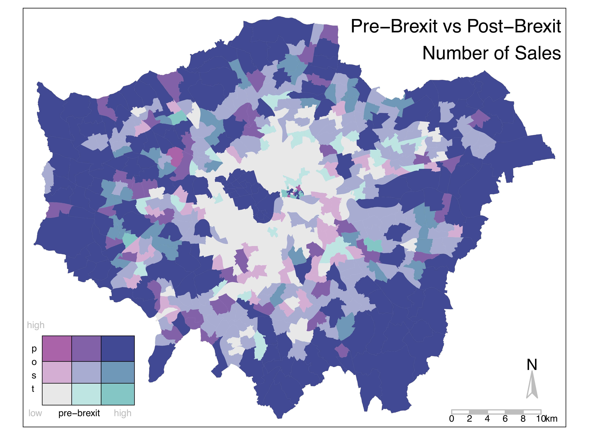
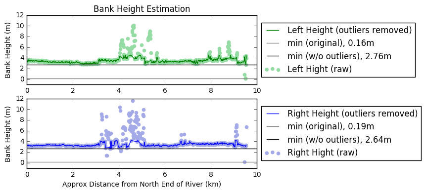

# UCL MSc GIS Coursework

This repository contains some, but not all, of the coursework completed in pursuit of the UCL MSc GIS.  It is provided here as a record of work, online portfolio, and active sandbox only.  No permission is given to use the code or ideas presented herein.  For any questions, please [contact me](malito:misshurst@gmail.com).

## Dissertation
For my dissertation topic, I'll be working to understand the impact of image resolution on automated vehicle detection in satellite imagery using machine learning techniques (specifically, Google's Object Detection API using TensorFlow and Convolutional Neural Networks).  Code for that project can be found in a separate repository [here](https://github.com/heidimhurst/dissertation).

## Term 1
Term 1 focused on building the foundations of geospatial analysis.  This included the following courses:

#### GIS Principles of Spatial Analysis ([GEOGG0125](http://www.geog.ucl.ac.uk/study/graduate-taught/msc-modules/geogg125))
Focused on statistical methods and learning the software package R.

Coursework included analyzing the London housing market ([pdf](https://github.com/heidimhurst/ucl_msc/blob/master/term1/gis_psa/bearma.pdf), [r code](https://github.com/heidimhurst/ucl_msc/blob/master/term1/gis_psa/bearmaneda.r)) and the presence of eating disorder risk factors among 15-year-old girls in London ([pdf](https://github.com/heidimhurst/ucl_msc/blob/master/term1/gis_psa/mirco.pdf), [r code](https://github.com/heidimhurst/ucl_msc/blob/master/term1/gis_psa/mirco.r)).

#### GIS Principles and Technology ([CEGEG082](https://sp.cege.ucl.ac.uk/study/Pages/Module-Guide.aspx?ModileCd=CEGEG082))
Focused on exploratory data analysis, especially in Python.

Coursework included implementation of an object-oriented point-in-polygon algorithm in Python ([code](https://github.com/heidimhurst/ucl_msc/blob/master/term1/gis_pt/coursework/Hurst_GISPT.py), [interactive example](https://heidimhurst.github.io/assets/html/PIP_visualization_w+.html)).

#### Representations, Structures, and Algorithms ([GEOGG0126](http://www.geog.ucl.ac.uk/study/graduate-taught/msc-modules/geogg126))
Focused on funamental algorithms and structures underpinning contemporary GIS technology, such as rasters and vectors and topological functions.

Coursework included literature review of multi-observer siting methods and a comparitive analysis of both Delaunay triantulation and Douglas-Peucker line simplification in ArcGIS and QGIS ([pdf](https://github.com/heidimhurst/ucl_msc/blob/master/term1/gis_rsa/RSA_coursework.pdf)).

#### Mapping Science ([CEGEG034](https://sp.cege.ucl.ac.uk/study/Pages/Module-Guide.aspx?ModileCd=CEGEG034))
Focused on fundamentals of mapping, including projections, cartography, basic GNSS...

Coursework included analysis of bank and flood height for Arun River ([pdf](https://github.com/heidimhurst/ucl_msc/blob/master/mapping_science/term1/tutorial2/tutorial2.pdf), [iPython](https://github.com/heidimhurst/ucl_msc/blob/master/term1/mapping_science/tutorial2/Arun%20River%20Flooding.ipynb)).

## Term 2
Term 2 courses included the following:

#### Image Understanding ([CEGEG075](https://sp.cege.ucl.ac.uk/study/Pages/Module-Guide.aspx?ModileCd=CEGEG075))
Explored traditional image analysis techniques, such as edge detection and feature extraction.

Coursework explored detection of vehicles in overhead imagery _without_ machine learning techniques ([pdf](https://github.com/heidimhurst/ucl_msc/blob/master/term2/images/coursework/ImageCoursework.pdf), [iPython](https://github.com/heidimhurst/ucl_msc/blob/master/term2/images/coursework/VPFW6_coursework.ipynb)).

#### Network and Locational Analysis ([GEOGG152](http://www.geog.ucl.ac.uk/study/graduate-taught/msc-modules/geogg152))
Coursework focused on the creation of a novel run-suggestion system, creating a cycle from a user-specified starting point that prioritized the traversal of novel graph edges ([html](https://heidimhurst.github.io/assets/networks/coursework.html)).

#### Spatio-temporal Data Mining ([CEGEG076](https://sp.cege.ucl.ac.uk/study/Pages/Module-Guide.aspx?ModileCd=CEGEG076))
Focused on spatio-temporal methods, including ARIMA, STARIMA, SVM, random forests, clustering.

Group coursework analyzing the Boston 311 dataset.

#### Spatial Databases ([CEGEG129](https://sp.cege.ucl.ac.uk/study/Pages/Module-Guide.aspx?ModileCd=CEGEG129))
Basic introduction to SQL databases.

